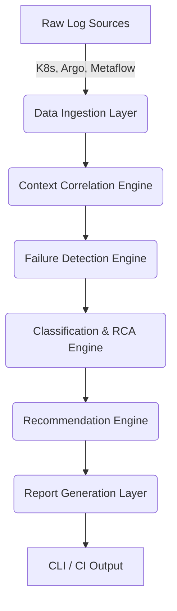

# Distributed Failure Intelligence & Observability System for Metaflow

## 1. System Objective
The Distributed Failure Intelligence System is designed to solve the complex debugging challenges that arise when executing Metaflow workflows on Kubernetes via Argo. By extracting, correlating, and analyzing logs from multiple distributed components (Kubernetes Pods, Argo workflow controllers, and Metaflow python processes), this system provides an intelligent failure report that drastically reduces developer root-cause analysis (RCA) time.

## 2. High-Level Architecture

The system is built sequentially in a pipeline architecture:

### 2.1. Data Ingestion Layer (`ingestion/`)
Responsible for abstracting away the log collection. It normalizes all logging formats into a single strongly-typed `LogEntry` model containing a timestamp, generic payload, source identifier, and metadata.

### 2.2. Context Correlation & DAG Engine (`correlator/`)
Raw logs from distributed systems are out of order and disconnected. The correlator sorts logs chronologically and groups them by step and pod to generate an `ExecutionTimeline`. 
- **DAG Extraction:** Automatically infers the parent-child node graph based on contextual state transitions.
- **Distributed Tracing Protocol:** An integrated `ChromeTraceExporter` exports the multi-layer (Argo vs K8s vs Metaflow) timeline into a standardized `trace.json` file. This acts as an open-telemetry compatible layer that developers can drag directly into `chrome://tracing` or Google Perfetto UI for visual debugging.

### 2.3. Analyzer Layer (`analyzer/`)
This is the core intelligence loop combining ML heuristics with deterministic rules:
- **Anomaly Detection Engine:** Calculates Term Frequency-Inverse Document Frequency (TF-IDF) scores across raw logs to calculate an `anomaly_score`. This heuristically highlights unique structural logs (silent failures) that standard REGEX rules might miss.
- **Detector & Classifier:** Applies layered confidence scoring (combining rules + anomaly scores) to categorize failures.
- **Inference & Recommender:** Maps extracted evidence to contextual, actionable next steps (like missing S3 bucket permissions for Metaflow Data Artifacts).

### 2.4. Report Generation & CLI (`reporter/` & `cli/`)
Aggregates the execution summary, trace logs, inferred root cause, and recommendations into a structured `AnalysisReport`. The CLI (`main.py`) formats this using rich text (via `Rich`) to present a beautiful, human-readable terminal output, or serialized JSON for downstream CI systems.

## 3. Supported Failure Scenarios
The rule engine out-of-the-box handles:
- **Application Failure:** Python user-code exceptions (e.g., `ValueError`, `ModuleNotFound`).
- **Infrastructure Failure:** Image pull issues, registry auth failures (`ImagePullBackOff`).
- **Resource Failure:** Pod memory limit violations (`OOMKilled`).
- **Orchestration Failure:** Argo DAG dependency resolution errors.

## 4. Design Decisions
1. **Pipeline Execution Model:** A strict DAG of data transformation (Ingest -> Correlate -> Analyze -> Report) guarantees easy testing and mocking.
2. **Abstracted Ingestion:** Allows swapping the current `simulator` implementation with actual Kubernetes/Argo clients seamlessly without altering the core engines.
3. **Rule-Based Engine:** Rather than utilizing fragile and expensive LLM calls for standard failures, the system uses a robust regex and heuristic-based rule engine. This ensures 100% deterministic, immediate classification for known failure modes. LLMs could theoretically be plugged into the `inference` module as a fallback for `UNKNOWN` categories.
4. **Strong Typing (Dataclasses):** Strict domain boundaries using Typed Python (`core.models`) prevent subtle schema changes from breaking the correlation and reporting layers.
